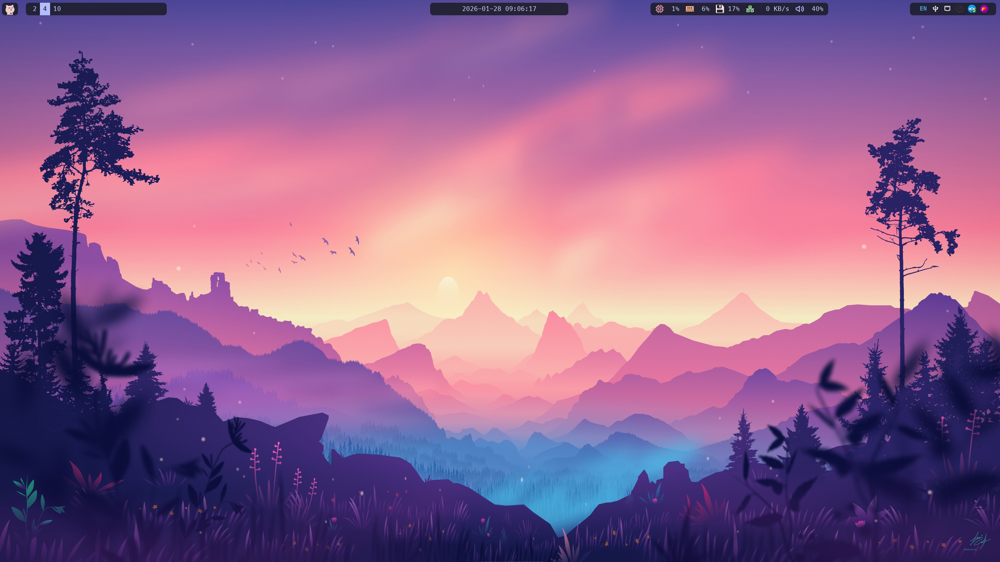
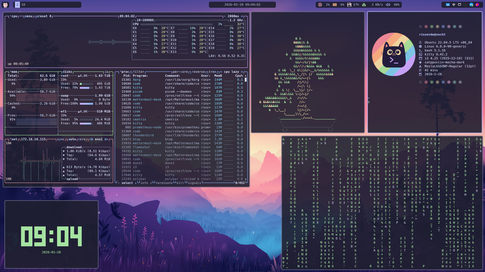
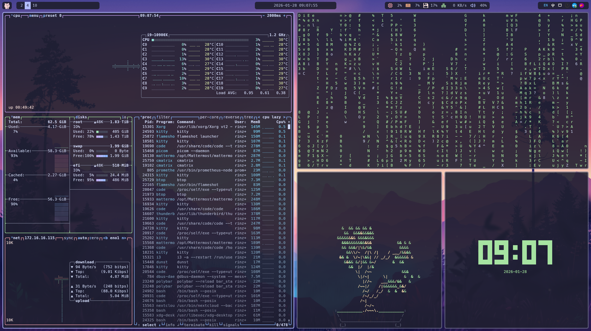

# Dotfiles

My dotfiles managed by gnu stow.





## Preconditions

Create some folder to prevent them being symlinked for other application.

```sh
mkdir -p ~/.local/share/man/man1
mkdir -p ~/.local/share/man/man5
mkdir -p ~/.local/share/fonts
mkdir -p ~/.local/share/icons
```

## Stow

### Install

```sh
sudo apt Install stow
```

### Stow all

```sh
stow conf.*
stow app.*
stow fonts
```

## Fonts

```sh
stow fonts
fc-cache -fv # update the font cache.
```

## Theming

Use `lxappearance`

Widget = Arc-Dark

Icon Theme = Papirus-Dark

Mouse Cursor = Catppuccin Mocha Dark

## Monitors

Use `ARandR` to configure the monitor(s).
Then save the configuration using `autorandr`.
The configuration will be automatically selected based on the connected devices.

```sh
autorandr --save <profile>
```

## Applications

```sh
sudo apt update && sudo apt install -y \
    arandr \
    autorandr \
    btop \
    dunst \
    fd-find \
    feh \
    flameshot \
    lxappearance \
    papirus-icon-theme \
    arc-theme \
    udiskie \
    udisks2 \
    xclip \
    shellcheck \
    code \
    xrdp \
    xorgxrdp \
    duf \
    keychain \
    policykit-1-gnome
```

```sh
pip3 install thefuck --user
```

- kitty: kitty-0.42.2-x86_64
- bat: bat-v0.25.0-x86_64-unknown-linux-musl
- fzf: fzf-0.65.2-linux_amd64
- lazygit: lazygit_0.55.0_linux_x86_64
- lsd: lsd-v1.1.5-x86_64-unknown-linux-musl
- ripgrep: ripgrep-14.1.1-x86_64-unknown-linux-musl
- ripgrep-all: ripgrep_all-v0.10.10-x86_64-unknown-linux-musl
- starship: starship-x86_64-unknown-linux-musl
- btop: apt version
- fastfetch: fastfetch-linux-amd64 2.58.0
- i3: i3-4.25
- picom: github.com/yshui/picom 2025 dec 9
- polybar: polybar-3.7.2
- rofi: rofi-2.0.0
- flameshot: v11.0.0
- i3lock-color: master Dec 12, 2025
- autotiling: v1.9.3
- yazi: yazi-x86_64-unknown-linux-musl 25.5.31

### bat

rebuild bat's cache to load the theme

```sh
bat cache --build
```

### git

add to `~/.gitconfig`

```sh
[include]
    path = ~/.git_aliases
```

### fd

symbolic link for fdfind to fd

```sh
ln -s $(which fdfind) ~/.local/bin/fd
```

### i3

Dependencies

```sh
sudo apt update && sudo apt install -y \
    meson \
    ninja-build \
    libev-dev \
    libpango1.0-dev \
    libstartup-notification0-dev \
    libxcb-cursor-dev \
    libxcb-icccm4-dev \
    libxcb-keysyms1-dev \
    libxcb-randr0-dev \
    libxcb-shape0-dev \
    libxcb-xinerama0-dev \
    libxcb-xrm-dev \
    libxkbcommon-x11-dev \
    libyajl-dev
```

Optional dependencies

```sh
sudo apt update && sudo apt install -y \
    dmenu \
    i3lock \
    asciidoc \
    i3status
```

Install

```sh
mkdir -p build && cd build
meson setup
ninja
sudo ninja install
```

### i3lock-color

Follow the installation in the `README.md` file.

### i3 autotiling

Dependencies

```sh
pip install i3ipc
```

### picom

Follow the installation in the `README.md` file.

#### required libconfig-1.8.2

Install

```sh
sudo apt install cmake
mkdir build && cd build
cmake ..
make
sudo make install
```

### polybar

Dependencies

```sh
sudo apt install build-essential git cmake cmake-data pkg-config python3-sphinx python3-packaging libuv1-dev libcairo2-dev libxcb1-dev libxcb-util0-dev libxcb-randr0-dev libxcb-composite0-dev python3-xcbgen xcb-proto libxcb-image0-dev libxcb-ewmh-dev libxcb-icccm4-dev
```

Optional Dependencies

```sh
apt install libxcb-xkb-dev libxcb-xrm-dev libxcb-cursor-dev libasound2-dev libpulse-dev libjsoncpp-dev libmpdclient-dev libcurl4-openssl-dev libnl-genl-3-dev
```

Install

```sh
mkdir build
cd build
cmake ..
make -j$(nproc)
# Optional. This will install the polybar executable in /usr/bin
sudo make install
```

### rofi

Dependencies

```sh
sudo apt update && sudo apt install -y \
    libgdk-pixbuf2.0-dev \
    libxcb-ewmh-dev
```

Install

```sh
meson setup -Dxcb=enabled build
ninja -C build install
```

### vscode

#### config

`~/.config/Code/User/settings.json`

```sh
{
    "catppuccin.accentColor": "lavender",
    "cmake.options.advanced": {
        "build": {
            "statusBarVisibility": "visible"
        },
        "cpack": {
            "statusBarVisibility": "hidden"
        },
        "ctest": {
            "statusBarVisibility": "icon"
        },
        "workflow": {
            "statusBarVisibility": "hidden"
        }
    },
    "cmake.options.statusBarVisibility": "compact",
    "editor.fontFamily": "MesloLGSDZ Nerd Font",
    "editor.minimap.size": "fill",
    "editor.renderControlCharacters": true,
    "editor.renderWhitespace": "all",
    "editor.rulers": [
        {
            "color": "#8f8f8f2d",
            "column": 120
        }
    ],
    "editor.semanticHighlighting.enabled": true,
    "explorer.confirmPasteNative": false,
    "files.insertFinalNewline": true,
    "files.trimFinalNewlines": true,
    "git.blame.editorDecoration.enabled": true,
    "security.workspace.trust.untrustedFiles": "open",
    "terminal.integrated.fontFamily": "MesloLGSDZ Nerd Font Mono",
    "terminal.integrated.scrollback": 10000,
    "workbench.colorTheme": "Catppuccin Mocha",
    "workbench.iconTheme": "catppuccin-mocha",
    "workbench.secondarySideBar.defaultVisibility": "hidden",
}
```

#### extensions

- Catppuccin.catppuccin-vsc
- Catppuccin.catppuccin-vsc-icons
- DavidAnson.vscode-markdownlint
- streetsidesoftware.code-spell-checker
- ms-vscode.cmake-tools
- ms-vscode.cpptools

### Fun terminal applications

```sh
sudo apt update && sudo apt install -y \
    cmatrix \
    cbonsai \
    tty-clock \
    cowsay \
    lolcat \
    fortune
```

- pipes.sh (installed using stow)
- cowthink (installed with cowsay)
